# HW1 - Virtual Machine Live Migration

[eeclass 作業頁](https://eeclass.nthu.edu.tw/course/homework/54820) · [作業說明網站](https://nthu-scopelab.github.io/cr-virtualization/live_migration/objective.html)

## 繳交內容

- [HW1_114064548.pdf](HW1_114064548.pdf)

[https://drive.google.com/file/d/1596iOUt4Sv0ptwpKKiq-Qs5gjKo4QKmp/view?usp=drive\_link](https://drive.google.com/file/d/1596iOUt4Sv0ptwpKKiq-Qs5gjKo4QKmp/view?usp=drive_link)

## 作業要求

作業說明(這次作業只有HW1的部份)：

[https://nthu-scopelab.github.io/cr-virtualization/live\_migration/objective.html](https://nthu-scopelab.github.io/cr-virtualization/live_migration/objective.html)

9/26(五)沒有課程內容，但我們會在13:20~13:40 進行作業說明，希望大家踴躍參與。

補: 使用中、英文撰寫報告皆可，不會影響評分。

---

來源：[Objective - Virtualization Lab](https://nthu-scopelab.github.io/cr-virtualization/live_migration/objective.html)

## Exploring Virtual Machine Live Migration: Performance Analysis and Optimization

### Live Migration

Live Migration is a crucial feature in virtualization technology that allows the transfer of a running virtual machine (VM) from one physical host to another without interrupting the VM’s operation or services. 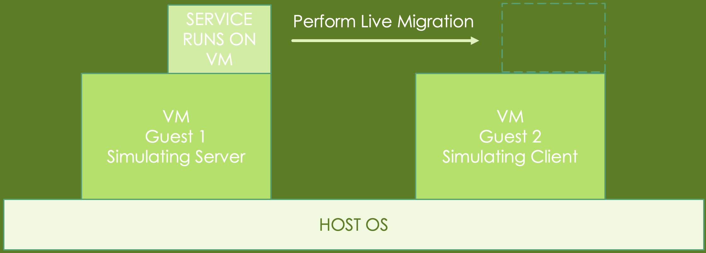

### The architecture we want to simulate:

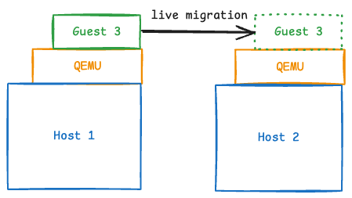

### Our Homework Architecture:

Since not everyone will have 2 PCs available to run QEMU on them, we provided an alternative option:  
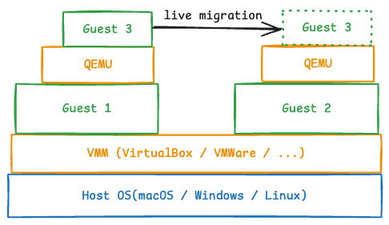

-   Note: VirtualBox now has native Apple Silicon support on Apple hardware with M-Series chips, but we haven’t yet tested the nested virtualization feature, so this homework may not work out on your hardware by default.
-   If you still want to test that out, feel free to ask us through the discussion/email on eeclass.
-   Or you can use the PC room in C.L.Liu(EECS) 3F, we already have VirtualBox installed in there.

---

來源：[Setup Environment(Guest 1 / Guest 2) - Virtualization Lab](https://nthu-scopelab.github.io/cr-virtualization/live_migration/setup-environment.html)

## Setup Environment

### Prerequisites

1.  We strongly suggests that your computer have at least 8GB of RAM and 30GB+ of storage space.
2.  First, use a hypervisor software to create two virtual machines on your computer.

-   If you’re using Linux : QEMU is recommended.
-   If you’re using Windows or MacOS : VMWare Workstation or VMWare Fusion are recommended.

The download link for VMware’s software can be elusive, so you might need to put in some effort to locate it.

3.  Next, go to download Ubuntu-24.04 desktop version as your Guest OS. It’s about 5.9G. You can grab it from here: [download link](https://free.nchc.org.tw/ubuntu-cd/24.04/)
    
4.  Search for [detailed](https://ubuntu.com/tutorials/how-to-run-ubuntu-desktop-on-a-virtual-machine-using-virtualbox#1-overview) [installation guide](https://ubuntu.com/tutorials/install-ubuntu-desktop#5-installation-setup) if you don’t know how to install Ubuntu yet.

---

來源：[VMWare Workstation - Virtualization Lab](https://nthu-scopelab.github.io/cr-virtualization/live_migration/setup-environment/vmware-workstation.html)

## VMWare Workstation

#### 1\. Assuming you’ve downloaded the VMWare Workstation installer and Ubuntu image file.

#### 2\. Install the VMWare Workstation.

#### 3\. Click “Create a New Virtual Machine” and proceed with the creation process.

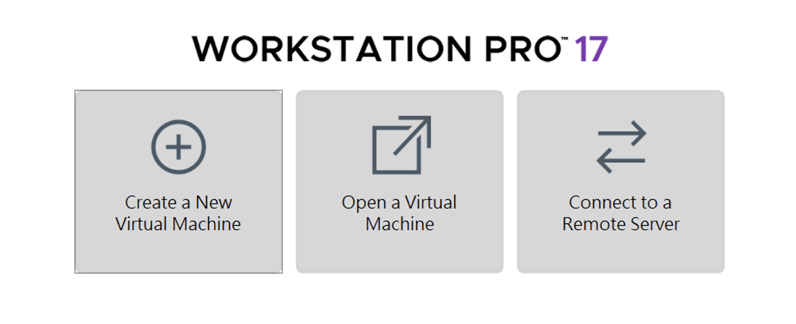

#### 4\. Use the Ubuntu image you’ve already downloaded. (Use the version you downloaded, not 20.04 in the image)

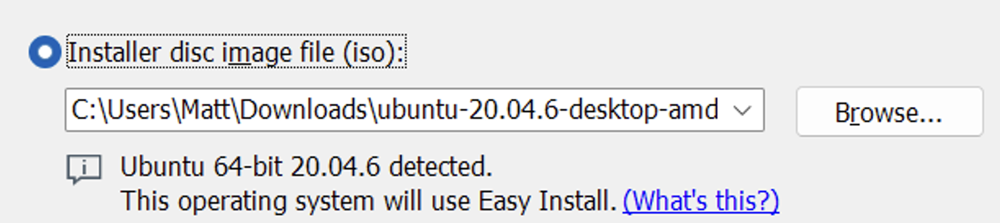

#### 5\. Click “Customize Hardware…”

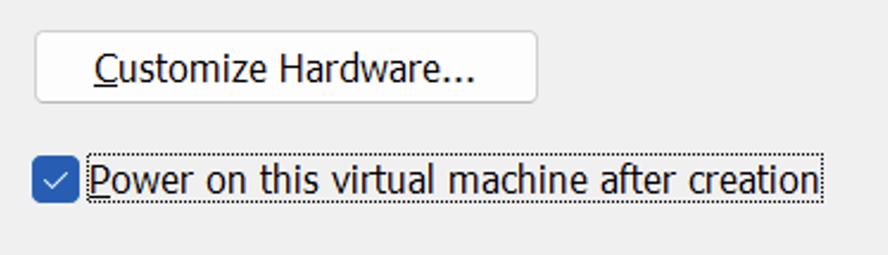

#### 6\. Go to “Processors” tab and enable “Virtualize Intel VT-x/EPT or AMD-V/RVI”.

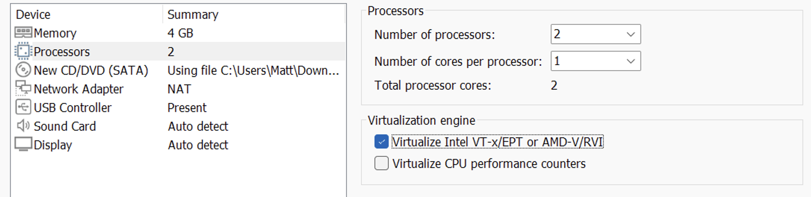

#### 7\. Repeat the above steps to create a second virtual machine.

#### 8\. Boot each virtual machine and complete the Ubuntu installation process.

#### 9\. After completing the installation process, open the terminal from your Applications menu.

---

來源：[VirtualBox - Virtualization Lab](https://nthu-scopelab.github.io/cr-virtualization/live_migration/setup-environment/virtualbox.html)

## VirtualBox

Using VirtualBox is similar to using VMWare Workstation, but you need to enable nested virtualization.

### Use GUI to enable Nested Virtualization

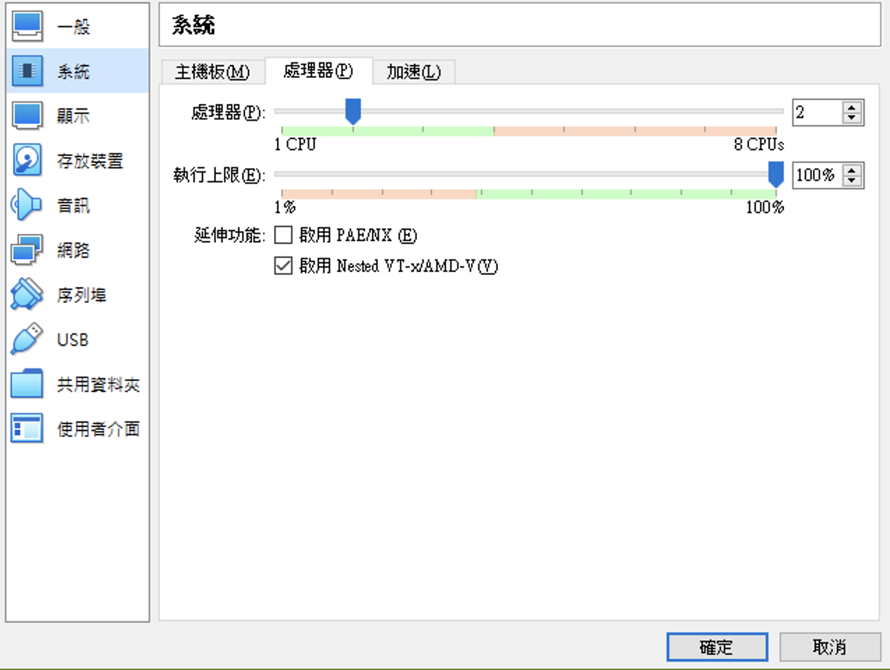

### Use Command Line to Enable Nested Virtualization

1.  Go to the directory of the VirtualBox you installed.
2.  Open Command Prompt right in the place.
3.  Enter the command below to enable nested virtualization:
    
    `.\VBoxManage.exe modifyvm "VM Name" --nested-hw-virt on`
    
    Replace `"VM Name"` with the name of your virtual machine.

---

來源：[QEMU - Virtualization Lab](https://nthu-scopelab.github.io/cr-virtualization/live_migration/setup-environment/qemu.html)

## QEMU

#### 0\. Before starting, setup a bridge `br0` for QEMU to bind to: (will be cleaned up naturally after a reboot)

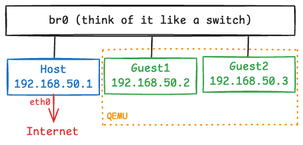

-   Choose a subnet/IP that does not conflict with your usecase. For CIDR notation, see [here](https://en.wikipedia.org/wiki/Classless_Inter-Domain_Routing#CIDR_notation).

`sudo ip link add br0 type bridge sudo ip addr add 192.168.50.1/24 dev br0 sudo ip link set br0 up`

-   After running the command above, you can inspect your current network settings:

`ip a`

-   Add a configuration file to enable qemu to automatically pick up your bridge configured above:

`sudo su mkdir -p /etc/qemu echo "allow br0" >> /etc/qemu/bridge.conf`

-   For host to provide internet access to all instances attached to this bridge, issue the following command:

`sudo sysctl -w net.ipv4.ip_forward=1 sudo iptables -A FORWARD -i br0 -o eth0 -j ACCEPT sudo iptables -A FORWARD -i eth0 -o br0 -m conntrack --ctstate ESTABLISHED,RELATED -j ACCEPT sudo iptables -t nat -A POSTROUTING -o eth0 -s 192.168.50.0/24 -j MASQUERADE`

-   Note: swap out `eth0` for your network interface that provides internet access, you can check it by issuing the following command:

`ip address`

#### 1\. First, create the disk image for `guest1`.

`qemu-img create -f qcow2 guest1.qcow2 20G`

#### 2\. Run `guest1` and complete the Ubuntu installation process.

`sudo qemu-system-x86_64 -cpu host -enable-kvm -m 4G -smp 1 \     -drive if=virtio,format=qcow2,file=guest1.qcow2 \     -nic bridge,br=br0,model=virtio-net-pci,mac=52:54:00:40:C9:01 \     -boot d -cdrom <your_ubuntu_img_file_path>.iso \     -vnc :1,password=on -monitor stdio`

-   In qemu console, type the following command to change the vnc password to the one you know:

`(qemu) change vnc password`

-   After changing the password to the one you know, use any VNC viewer (e.g. : RealVNC, vncviewer) connect to (Your host IP):5901 (e.g. : 192.168.7.102:5901 or 127.0.0.1:5901), and complete the installation process.
-   After Ubuntu installation is complete, remove the `-boot d -cdrom <your_img_file_path>.iso` part from the above command and run `guest1` again.
-   If you want to reach internet or other device on this guest instance, you may want to manually configure your IP under the same subnet. (e.g. `192.168.50.2`, subnet mask: `255.255.255.0`, gateway: `192.168.50.1`)

#### 3\. Repeat the same steps for `guest2`

`qemu-img create -f qcow2 guest2.qcow2 20G sudo qemu-system-x86_64 -cpu host -enable-kvm -m 4G -smp 1 \     -drive if=virtio,format=qcow2,file=guest2.qcow2 \     -nic bridge,br=br0,model=virtio-net-pci,mac=52:54:00:40:C9:02 \     -boot d -cdrom <your_ubuntu_img_file_path>.iso \     -vnc :1,password=on -monitor stdio`

-   In qemu console, type the following command to change the vnc password to the one you know:

`(qemu) change vnc password`

-   Using any VNC viewer (e.g. : RealVNC, vncviewer) connect to (Your host IP):5902 (e.g. : 192.168.7.102:5902 or 127.0.0.1:5902), and complete the installation process.
    
-   After Ubuntu installation is complete, remove the `-boot d -cdrom <your_img_file_path>.iso` part from the above command and run `guest2` again.
    
-   If you want to reach internet or other device on this guest instance, you may want to manually configure your IP under the same subnet. (e.g. `192.168.50.3`, subnet mask: `255.255.255.0`, gateway: `192.168.50.1`)

---

來源：[Live Migration - Virtualization Lab](https://nthu-scopelab.github.io/cr-virtualization/live_migration/live-migration.html)

## Live Migration

In this section, you need to demonstrate the above steps of the presentation through a screen recording, showing how you perform live migration on VMs using the framework we provided.

-   For more information, refer to the [Assignment section](https://nthu-scopelab.github.io/cr-virtualization/live_migration/assignment.html).

---

來源：[Task 1: Setting up guest1 - Virtualization Lab](https://nthu-scopelab.github.io/cr-virtualization/live_migration/live-migration/task1.html)

## Task 1: Setting up guest1

#### 1\. Enter the following command into the terminal:

`sudo apt update -y sudo apt install -y vim qemu-kvm nfs-kernel-server net-tools`

#### 2\. Before launching QEMU on the first guest VM, obtain the IP address of this VM.

`ip a`

For example: 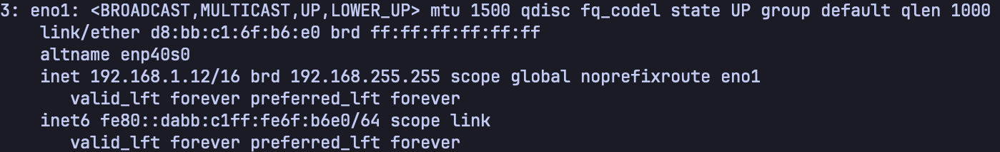

#### 3\. Create a QEMU image file:

`qemu-img create -f qcow2 ubuntu.qcow2 10G`

#### 4\. Create a new directory in `/mnt` and modify its ownership and permissions:

`sudo mkdir -p /mnt/nfs sudo chown nobody:nogroup /mnt/nfs sudo chmod 777 /mnt/nfs`

#### 5\. Move the QEMU image file you just created into the new directory:

`mv ubuntu.qcow2 /mnt/nfs`

#### 6\. Edit the file at `/etc/exports` with superuser privileges:

`sudo vim /etc/exports`

#### 7\. Add the following line to the end of the exports file and save it:

`/mnt/nfs *(rw,sync,no_subtree_check,no_root_squash)`

#### 8\. Return to the terminal and enter this command to update the exports file:

`sudo exportfs -arv`

#### 9\. Launch QEMU to simulate a running process on the virtual machine:

`sudo qemu-system-x86_64 \     -cpu host -enable-kvm -m 2G -smp 1 \     -drive if=virtio,format=qcow2,file=/mnt/nfs/ubuntu.qcow2 \     -monitor telnet:127.0.0.1:5500,server,nowait`

A window similar to this will then appear: 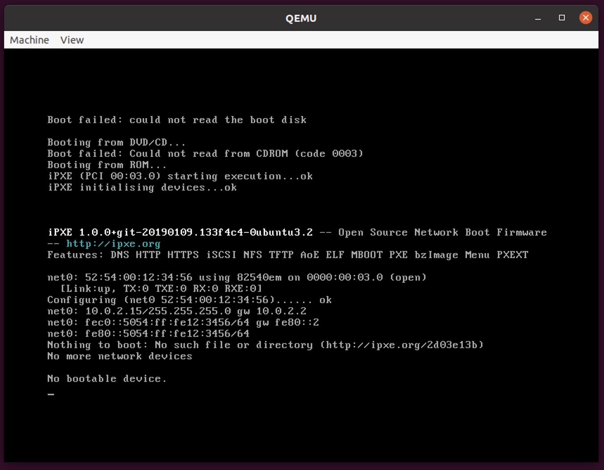

---

來源：[Task 2: Setting up guest2 - Virtualization Lab](https://nthu-scopelab.github.io/cr-virtualization/live_migration/live-migration/task2.html)

## Task 2: Setting up guest2

#### 1\. Enter the following commands into the terminal:

`sudo apt update -y sudo apt install -y qemu-kvm net-tools nfs-common`

#### 2\. Before launching QEMU on the second guest VM, obtain the IP address of this VM.

`ip a`

#### 3\. Enter the following commands into the terminal to mount NFS service:

`sudo mkdir -p /mnt/nfs sudo mount -t nfs <replace_with_guest1_ip>:/mnt/nfs /mnt/nfs`

#### 4\. Luanch QEMU on the second VM to prepare for the incoming live virtual machine migration:

`sudo qemu-system-x86_64 \     -cpu host -enable-kvm -m 2G -smp 1 \     -drive if=virtio,format=qcow2,file=/mnt/nfs/ubuntu.qcow2 \     -incoming tcp:0:4400`

A window similar to this will then appear: 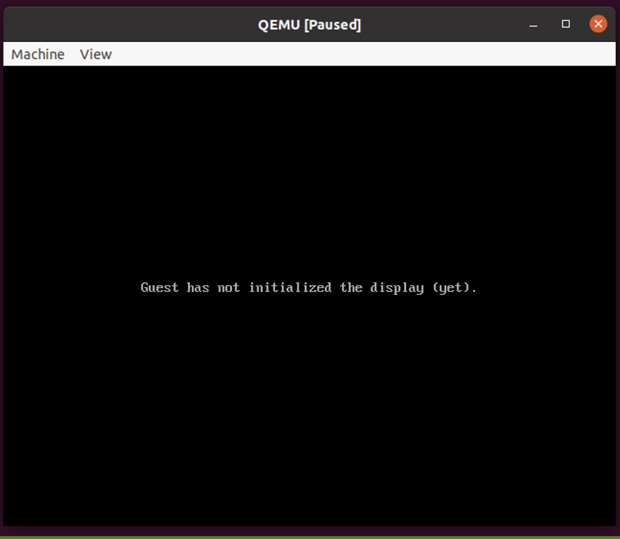

---

來源：[Task 3: Migrate from guest1 to guest2 - Virtualization Lab](https://nthu-scopelab.github.io/cr-virtualization/live_migration/live-migration/task3.html)

## Task 3: Migrate from guest1 to guest2

#### 1\. Return the first guest VM, open a new terminal tab, and enter the following command:

`telnet 127.0.0.1 5500`

#### 2\. Upon the new command prompt, issue the following command to initiate the live migration process:

`migrate -d tcp:<replace_with_guest2_ip>:4400`

#### 3\. Show the migration info:

`info migrate`

#### 4\. The screen of the QEMU window on `guest2` should now appear as follows:

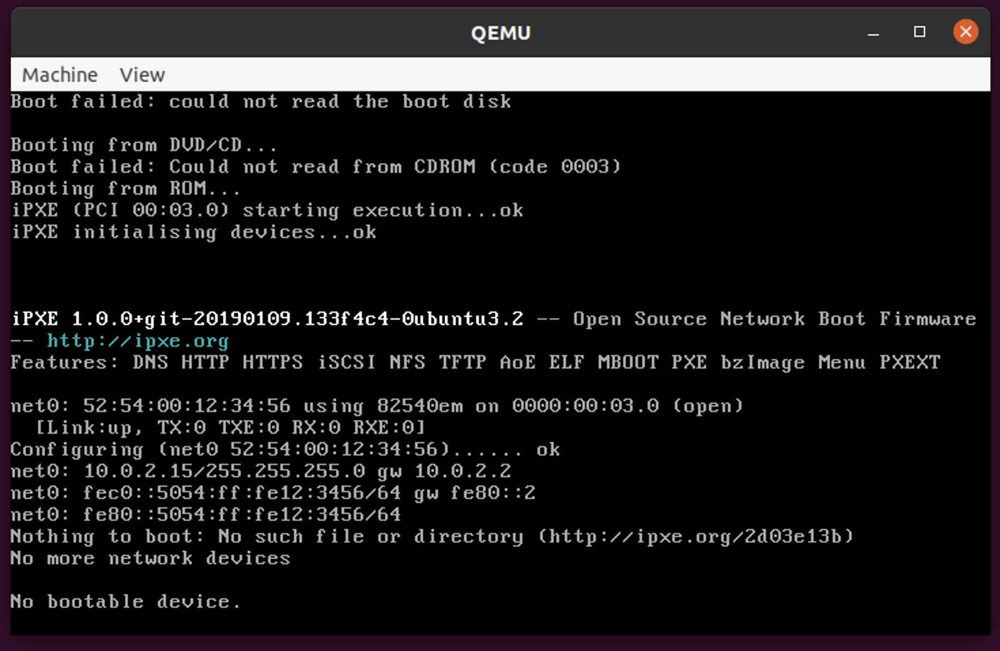

This indicates that you’ve successfully completed the live migration of the virtual machine.

---

來源：[Assignment - Virtualization Lab](https://nthu-scopelab.github.io/cr-virtualization/live_migration/assignment.html)

## Assignment

### Requirements

#### 1\. Demo (40 points)

-   You need to demonstrate the above steps of the presentation through a screen recording, showing how you perform live migration on VMs using the framework we provided.
-   You need to include every step involved in setting up guest 1 / guest 2, as well as the entire live migration process. This means your demo video should consist of _**every single step**_ documented in these three pages:
    -   [Task 1: Setting up guest1](https://nthu-scopelab.github.io/cr-virtualization/live_migration/live-migration/task1.html)
    -   [Task 2: Setting up guest2](https://nthu-scopelab.github.io/cr-virtualization/live_migration/live-migration/task2.html)
    -   [Task 3: Migrate from guest1 to guest2](https://nthu-scopelab.github.io/cr-virtualization/live_migration/live-migration/task3.html)
    -   You are free to simplify the execution through the measure of scripting. e.g., cloud-init, bash, ansible…etc.
    -   However, pasting commands one by one is also accepted, scripting is not required, and won’t earn you any extra points.
    -   Do keep in mind that if setup steps were not completely included in the demo, _**20 points will be deducted**_.
-   If you have any questions regarding what this may imply, make sure you ask the TA before recording.
-   Name the record video file as `HW1_<your_student_id>.xxx`, e.g. `HW1_113062566.mov` or `HW1_113062566.mp4`.
-   The length of this video should not exceed _**30 minutes**_.
-   Upload the video to a cloud storage service and provide a link _**with viewing permission**_.
    -   This can be done using YouTube, Google Drive, Dropbox, or any other similar service.
-   Example:

#### 2\. Report (60 points)

-   You have to make a report of _**pdf format**_ named `HW1_1_<your_student_id>.pdf`, e.g. `HW1_1_113062566.pdf`.
-   The report should include the following items:
    -   A. Provide a detailed explanation of each instruction, including the purpose of individual arguments within the commands. **(5 points)**
    -   B. Show the performance testing results by `perf` with and without `-enable-kvm` on VM; furthermore compare among them and simply explain the results **(10 points)**
    -   C. Show the performance testing results by `iperf` with and without `virtio` on VM; furthermore compare among them and explain the results **(10 points)**
    -   D. Show the performance measurements by `perf` and `iperf` during the live migration is progressing; furthermore, simply describe your observations. **(10 points)**
    -   E. What is “live migration” and why we need it. **(10 points)**
    -   F. QEMU has a “fault tolerance” feature called [COLO](https://wiki.qemu.org/Features/COLO). We don’t ask you to utilize this feature in this assignment, but some questions you may answer :
        -   What is fault-tolerance in virtualization technology and why we require it? **(7.5 points)**
        -   What are the relationships between live migration and fault-tolerance? **(7.5 points)**

### Submission

Submit both the demo video link and the report to eeclass.

### Deadline

The deadline is set for October 25, 2026 23:59. Late submission is not allowed.

If you have any question, feel free to asking through eeclass or email.
