# HW2 - Docker and Kubernetes

[eeclass 作業頁](https://eeclass.nthu.edu.tw/course/homework/56421) · [作業說明網站](https://nthu-scopelab.github.io/cr-virtualization/docker_kubernetes/objective.html)

## 繳交內容

- [HW2_114064548.pdf](HW2_114064548.pdf)

## 作業要求

作業說明(這次作業只有HW2的部份)：

[https://nthu-scopelab.github.io/cr-virtualization/docker\_kubernetes/objective.html](https://nthu-scopelab.github.io/cr-virtualization/docker_kubernetes/objective.html)

使用中、英文撰寫報告皆可，不會影響評分。

---

來源：[Objective - Virtualization Lab](https://nthu-scopelab.github.io/cr-virtualization/docker_kubernetes/objective.html)

## Containerized Socket Communication: Using Docker and Kubernetes

#### This assignment has two phases:

-   The first phase requires you to explore how to use Docker.
-   The second phase is to create services using Kubernetes. Each phase has several tasks.

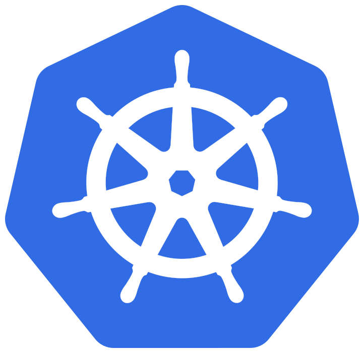 

---

來源：[Setup Environment - Virtualization Lab](https://nthu-scopelab.github.io/cr-virtualization/docker_kubernetes/setup-environment.html)

## Setup Environment

### Prequisite

We have provided the required files for this assignment. Please download them from [here](https://github.com/NTHU-SCOPELAB/cr-virtualization/releases/latest/download/hw2-amd64.zip).

If you’re using Apple Silicon Macs(M1,M2,…), then you should grab [this one](https://github.com/NTHU-SCOPELAB/cr-virtualization/releases/latest/download/hw2-arm64.zip) instead.

The required files are as follows (included within the downloaded `hw2-amd64.zip` or `hw2-arm64.zip`):

`docker   |-- server   |     |-- Dockerfile   |     |-- socket_server   |   |-- client         |-- Dockerfile         |-- socket_client.c  k8s   |-- deployment.yaml   |-- service.yaml`

In addition, you must install the following programs on your computer:

-   [Docker](https://docs.docker.com/get-started/get-docker/): A tool that is used to automate the deployment of applications.
-   [Minikube](https://minikube.sigs.k8s.io/docs/start/): Local Kubernetes, focusing on making it easy to learn for Kubernetes.
-   [Kubectl](https://kubernetes.io/docs/tasks/tools/#kubectl): Command line tool for communicating with a control plane.

There are different installation processes dependending on your operating system. You must have _**root permissions**_ in your system.

---

來源：[Docker - Virtualization Lab](https://nthu-scopelab.github.io/cr-virtualization/docker_kubernetes/docker.html)

## Docker

#### In this task, you are required to create two Docker containers. One container runs the server, and the other container runs the client, allowing the client to communicate with the server and transmit messages.

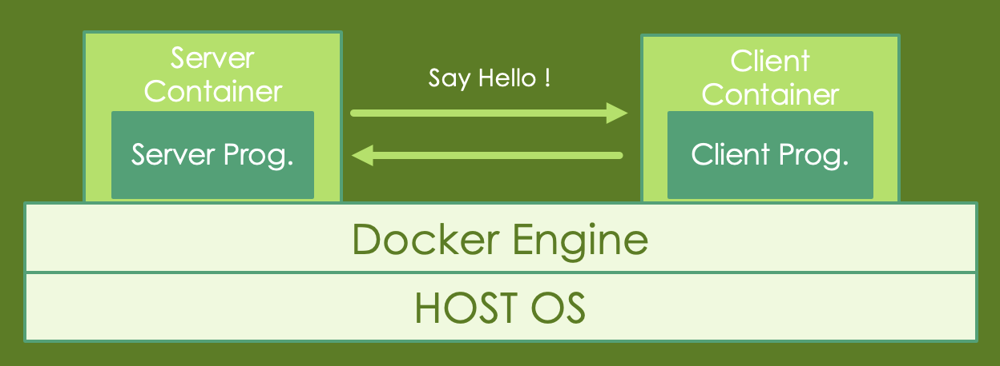

#### Once you have installed Docker and downloaded the required files, you can proceed with the following steps.

#### Note: In this section, you are required to take screenshots of the command output to include in your report when you see something like this:

**Note:** This is an example of what you would see when you are required to take screenshot and include in your report. **(0 points)**

---

來源：[Task 1: Building the images - Virtualization Lab](https://nthu-scopelab.github.io/cr-virtualization/docker_kubernetes/docker/task1.html)

## Task 1: Building the images

#### 1\. Enter the client folder, open and modify the `PLEASE ASSIGN` section and append your student ID in `socket_client.c` as shown in the following image:

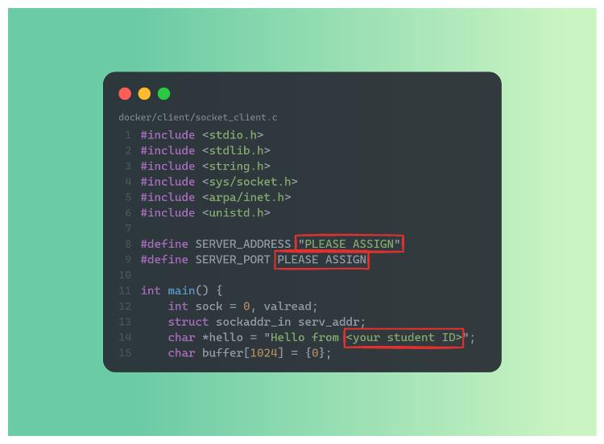

#### 2\. Build the image with the Dockerfile

`cd path/to/server docker build -t server-<your_student_id> cd path/to/client docker build -t client-<your_student_id>`

You can use the following command to check images you’ve built:

`docker images`

You need to submit the screenshot of the list of your images. **(5 points)**

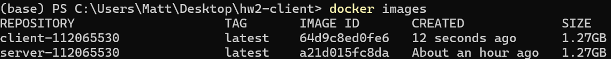

#### 3\. Launch the server container first, and then launch the client container:

`docker run -it --rm --network host \     --name server \     server-<your_student_id> docker run -it --rm --network host \     --name client \     client-<your_student_id>`

The command `docker run` will create the container instance with the image and execute the container.

You need to submit the screenshot of the output of the server and client containers. **(5 points)**

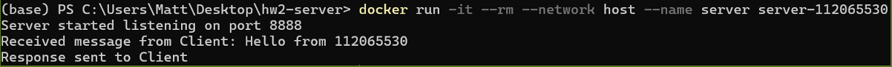 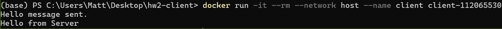

---

來源：[Task 2: Creating bridge - Virtualization Lab](https://nthu-scopelab.github.io/cr-virtualization/docker_kubernetes/docker/task2.html)

## Task 2: Creating bridge

#### In this task, you are required to create a bridge to connect two container. (_**not related to Task 1**_)

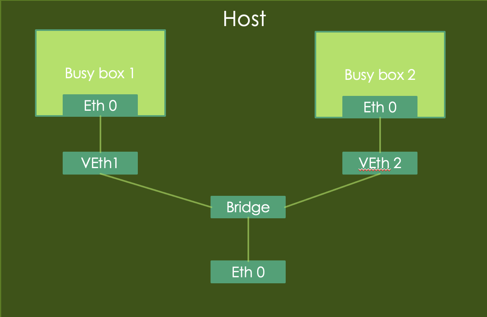

#### 1\. Create 2 containers using the following commands:

`docker container run -d --rm --name box1 busybox /bin/sh -c "while true; do sleep 3600; done"`

`docker container run -d --rm --name box2 busybox /bin/sh -c "while true; do sleep 3600; done"`

#### 2\. Create a network bridge:

`docker network create box-bridge`

#### 3\. Connecting two running containers to the network bridge:

`docker network connect box-bridge box1 docker network connect box-bridge box2`

#### 4\. You can use the following command to list docker networks:

`docker network ls`

**Note:** You need to include the screenshot of the command output above in your report. **(5 points)**

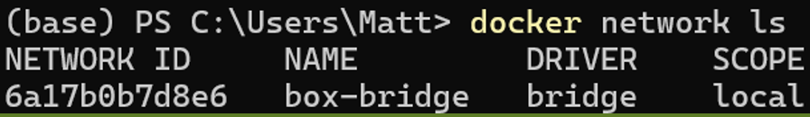

#### 5\. You can inspect more about the details of the `box-bridge` network:

`docker network inspect box-bridge`

**Note:** You need to include the screenshot of the command output above in your report. Points WILL BE DEDUCTED if any output text get cropped out. **(5 points)**

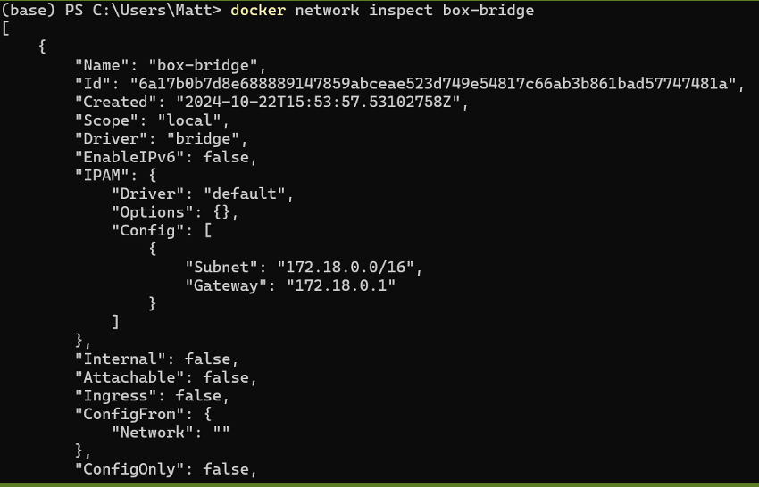

#### 6\. Log into `box1` and try to ping `box2`:

`docker exec -it box1 sh ping box2`

**Note:** You need to include the screenshot of the command output above in your report. **(5 points)**

---

來源：[Task 3: Creating volume - Virtualization Lab](https://nthu-scopelab.github.io/cr-virtualization/docker_kubernetes/docker/task3.html)

## Task 3: Creating volume

#### 1\. You need to use `docker volume create` to create a volume and share the volume between two containers.

#### 2\. You need to use `bind mounts` to share a directory between two containers.

**Note:** 1 and 2 are independent steps. Make sure you include the following into your report:

-   Briefly describe how you did it, and use screenshots to assist your explanation. **(10 points)**
-   What's the difference between these two steps? **(5 points)**

#### 3\. Answer the following questions: (20 points)

-   Please explain the difference between Docker Container and Virtual Machine. \***(10 points)**
-   Docker is more unsafe than virtual machine, please explain why and what’s causing this issue. _**(10 points)**_

---

來源：[Kubernetes - Virtualization Lab](https://nthu-scopelab.github.io/cr-virtualization/docker_kubernetes/kubernetes.html)

## Kubernetes

#### Description

In this task, you’re required to create services using Kubernetes. We will use the image files from the previous phase to build our services and use the client container to communicate with the services.

#### You need to figure out the following concept in the process:

-   The relation between `Deployment`, `Replica Set` and `Pod`.
-   How pod management works in Kubernetes.
-   How to expose an application with the `Service`.
-   The difference between `ClusterIP`, `NodePort`, and `LoadBalancer`.

Once you have:

-   installed Docker
-   installed Minikube
-   installed Kubectl（Check the version to verify if it’s installed)
-   and downloaded the required files

you can proceed with the following steps.

---

來源：[Task 1: Launching K8s and deploy our containers - Virtualization Lab](https://nthu-scopelab.github.io/cr-virtualization/docker_kubernetes/kubernetes/task1.html)

## Task 1: Launching K8s and deploy our containers

### Launch your Kubernetes cluster

#### 1\. Start the Kubernetes cluster

`minikube start`

#### 2\. Get the instructions to point your docker client to point to the minikube docker daemon

`minikube docker-env`

#### 3\. Check the status of your minikube deployment

`minikube status`

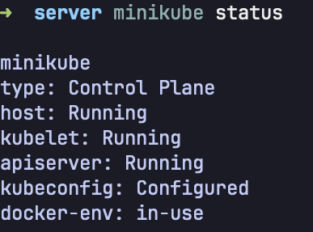

### Deploy the containers into the cluster

#### 1\. Enter the k8s folder, modify the files as required and input the following command:

`kubectl apply -f deployment.yaml kubectl apply -f service.yaml`

#### 2\. Check the status of your deployment

`kubectl get pods kubectl get deployment kubectl get services`

**Note:** You need to include the screenshot of the command output above in your report. **(10 points)**

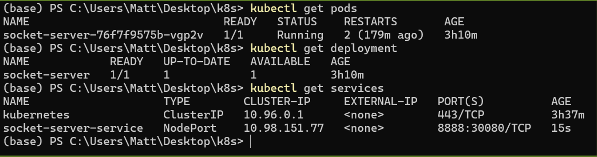

#### 3\. Answer the following questions and include the answers in your report:

-   What is Kubernetes? Why do we need it? _**(5 points)**_
-   Please explain the concepts of `Deployment`, `Service` and `Pod`. _**(5 points)**_
-   Why k8s use pod to manipulate the application instead of the container. _**(5 points)**_
-   What is `Replica Set` in Kubernetes? _**(5 points)**_
-   Why can the client successfully communicate through port 30080 when the server is listening on port 8888? _**(10 points)**_

### (Optional) Check if your container is running correctly on the minikube

#### 1\. Get the ip address of the minikube:

`minikube ip`

#### 2\. Open and modify the `PLEASE ASSIGN` section in `docker/client/socket_client.c`. (Assign your actual minikube ip to `SERVER_ADDRESS`):

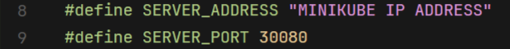

#### 3\. Build and run the client container.

### Tear down the deployed services and minikube cluster after you finished testing:

`kubectl delete -f service.yaml kubectl delete -f deployment.yaml minikube stop`

---

來源：[Helper: Using K8sGPT to help debugging your issue - Virtualization Lab](https://nthu-scopelab.github.io/cr-virtualization/docker_kubernetes/kubernetes/helper.html)

## Helper: Using K8sGPT to help debugging your issue

### THIS PART IS NOT A REQUIREMENT, YOU WON’T EARN ANY EXTRA POINTS BY PUTTING THIS INTO YOUR REPORT.

### 0\. Prerequisite

-   You need to have a google account that have access to Google AI Studio.
-   You can use your local or other model provider as [backend](https://docs.k8sgpt.ai/reference/providers/backend/), but we’ll use the free `gemini-2.5-flash` API from Google AI Studio as an example here.
-   If you care about privacy when running K8sGPT on your PC, you may want to [check this out](https://docs.k8sgpt.ai/reference/guidelines/privacy/).

### 1\. Install K8sGPT

-   Follow the official instructions [here](https://docs.k8sgpt.ai/getting-started/installation/).
-   Or download the binaries directly from the [latest release](https://github.com/k8sgpt-ai/k8sgpt/releases/tag/latest).

### 2\. Generate API Key from Google AI Studio

#### a. Go to [Google AI Studio](https://studio.google.com/) and sign in with your Google account.

#### b. Click on “Get API Key” button on the bottom left corner.

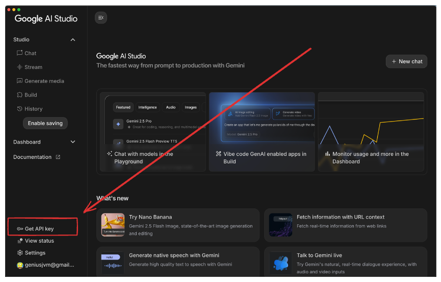

#### c. Create API Key

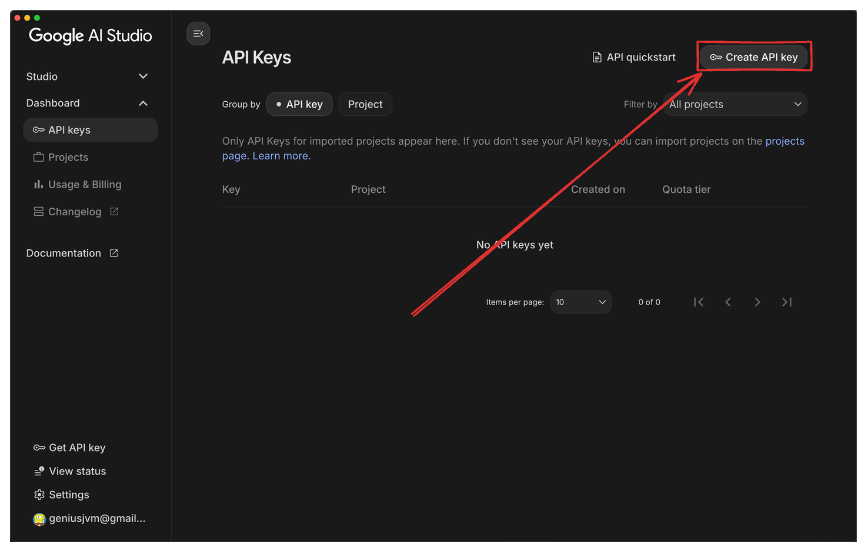 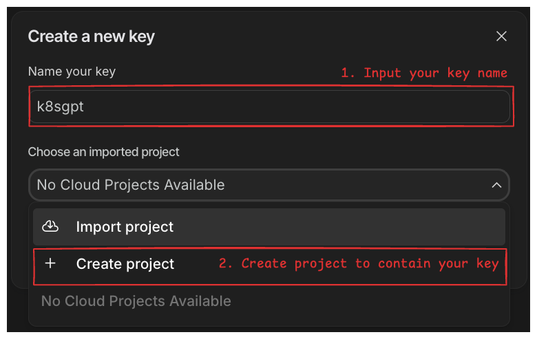 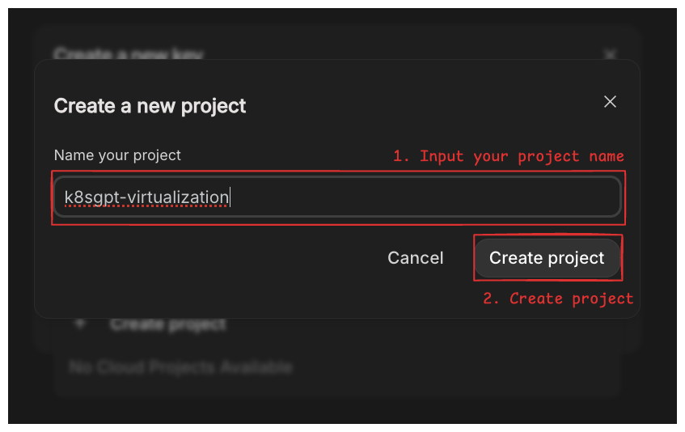 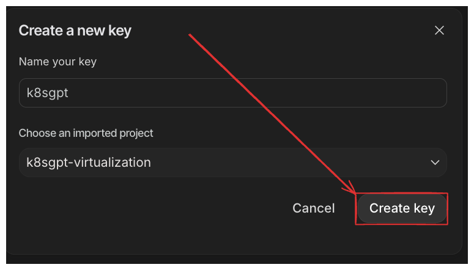

#### d. Copy the generated API key and save it somewhere safe.

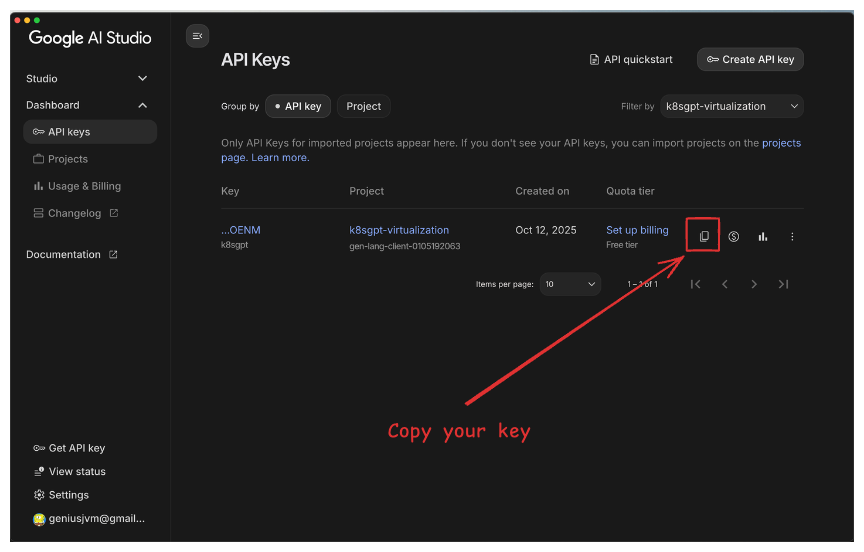

### 3\. Setup K8sGPT to use Gemini API as backend

-   Replace `YOUR_API_KEY` with the API key you generated in step 2.

`k8sgpt auth add --backend google --model gemini-2.5-flash --password "YOUR_API_KEY"`

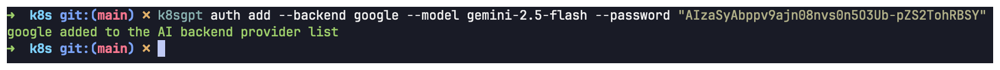

### 4\. Ask K8sGPT to analyze your cluster and try to explain the issue:

`k8sgpt analyze --explain --backend google`

-   Result:

``➜  k8s git:(main) ✗ k8sgpt analyze --explain --backend google                                                              W1012 01:04:58.380993 3501705 warnings.go:70] v1 Endpoints is deprecated in v1.33+; use discovery.k8s.io/v1 EndpointSlice 100% |████████████████████████████████████████████████████████████████████████████████████| (13/13, 8 it/min) AI Provider: google  0: Deployment default/socket-server() - Error: Deployment default/socket-server has 1 replicas in spec but 2 replicas in status because status field is not updated yet after scaling and 0 replicas are available with status running Error: Deployment spec (1) and status (2) mismatch, likely due to a delayed status update after scaling. No pods are currently running. Solution: 1. Wait a moment; it often self-corrects. 2. If persistent, check `kubectl get pods -l app=socket-server` for pod status. 3. If pods are stuck, `kubectl describe pod <pod-name>` for events/errors.  1: ConfigMap default/kube-root-ca.crt() - Error: ConfigMap kube-root-ca.crt is not used by any pods in the namespace Error: ConfigMap 'kube-root-ca.crt' exists but no pods in this namespace are configured to use it. It's currently unused. Solution: 1. If required, modify pod spec to mount it. 2. If not, delete it: `kubectl delete cm kube-root-ca.crt`.  2: ConfigMap kube-node-lease/kube-root-ca.crt() - Error: ConfigMap kube-root-ca.crt is not used by any pods in the namespace Error: ConfigMap 'kube-root-ca.crt' exists but no pods in this namespace are configured to use it. It's currently unused. Solution: 1. If required, modify pod spec to mount it. 2. If not, delete it: `kubectl delete cm kube-root-ca.crt`.  3: ConfigMap kube-public/cluster-info() - Error: ConfigMap cluster-info is not used by any pods in the namespace Error: ConfigMap 'cluster-info' exists but no pods are currently configured to use it in the namespace. Solution: 1. Verify if 'cluster-info' is still required. 2. If not, delete it: `kubectl delete configmap cluster-info`.  4: ConfigMap kube-public/kube-root-ca.crt() - Error: ConfigMap kube-root-ca.crt is not used by any pods in the namespace Error: ConfigMap 'kube-root-ca.crt' exists but no pods in this namespace are configured to use it. It's currently unused. Solution: 1. If required, modify pod spec to mount it. 2. If not, delete it: `kubectl delete cm kube-root-ca.crt`.  5: ConfigMap kube-system/extension-apiserver-authentication() - Error: ConfigMap extension-apiserver-authentication is not used by any pods in the namespace Error: ConfigMap 'extension-apiserver-authentication' exists but no pods in the namespace are configured to use it. Solution: 1. Confirm if this ConfigMap is truly needed. 2. If not, delete it: `kubectl delete cm extension-apiserver-authentication`.  6: ConfigMap kube-system/kube-apiserver-legacy-service-account-token-tracking() - Error: ConfigMap kube-apiserver-legacy-service-account-token-tracking is not used by any pods in the namespace Error: ConfigMap `kube-apiserver-legacy-service-account-token-tracking` exists but no pods use it. It's likely obsolete or misconfigured. Solution: 1. Verify if ConfigMap is needed. 2. If not, delete it: `kubectl delete cm kube-apiserver-legacy-service-account-token-tracking -n <ns>`. 3. If needed, check pod specs.  7: ConfigMap kube-system/kube-root-ca.crt() - Error: ConfigMap kube-root-ca.crt is not used by any pods in the namespace Error: ConfigMap 'kube-root-ca.crt' exists but no pods in this namespace are configured to use it. It's currently unused. Solution: 1. If required, modify pod spec to mount it. 2. If not, delete it: `kubectl delete cm kube-root-ca.crt`.  8: ConfigMap kube-system/kubeadm-config() - Error: ConfigMap kubeadm-config is not used by any pods in the namespace Error: The `kubeadm-config` ConfigMap exists but no pods are currently using it. Solution: 1. Verify if it's still needed. 2. If not, delete it: `kubectl delete cm kubeadm-config -n kube-system`.  9: ConfigMap kube-system/kubelet-config() - Error: ConfigMap kubelet-config is not used by any pods in the namespace Error: The ConfigMap named 'kubelet-config' exists in the namespace but no running pods are currently configured to mount or reference it, making it an unused resource. Solution: 1. Verify if 'kubelet-config' is still required. 2. If not, delete it: `kubectl delete cm kubelet-config`. 3. If needed, update relevant pod specs to mount it.  10: Service default/socket-server-service() - Error: Service has not ready endpoints, pods: [Pod/socket-server-76b4f57897-7vtjl Pod/socket-server-7fdb5cb468-drlg6], expected 2 Error: The Service can't route traffic because its pods aren't ready or healthy. Solution: 1. `kubectl get pods` for status. 2. `kubectl logs <pod-name>` for errors. 3. `kubectl describe pod <pod-name>` for events/readiness. 4. Verify container port matches Service targetPort.  11: Pod default/socket-server-76b4f57897-7vtjl(Deployment/socket-server) - Error: Failed to apply default image tag "server-<your student ID>": couldn't parse image name "server-<your student ID>": invalid reference format: repository name (library/server-<your student ID>) must be lowercase Error: Image repository names must be lowercase. Your image name `server-<ID>` contains uppercase characters, causing an invalid reference format. Solution: 1. Change the image name `server-<ID>` to all lowercase (e.g., `server-<id>`). 2. Update your Kubernetes manifest (YAML) with the corrected image name.  12: Pod default/socket-server-7fdb5cb468-drlg6(Deployment/socket-server) - Error: Container image "server-113062566" is not present with pull policy of Never Error: Container image "server-113062566" isn't found on the node; its 'Never' pull policy prevents downloading. Solution: 1. Ensure image is built/loaded onto the node. 2. Or, update pod spec's `imagePullPolicy` to `IfNotPresent` to allow pulling from a registry.``

-   Now you can start to look for hints to solve the issue, or feed this information to the LLM you use to provide better context to solve your problem.

`# Before proceeding, make sure you have modified the deployment.yaml accordingly(socket-server container name). # In docker/server, build the image inside minikube minikube image build -t server-<your student ID> .  # In k8s, after patching the image name in deployment.yaml kubectl delete -f service.yaml kubectl delete -f deployment.yaml kubectl apply -f deployment.yaml kubectl apply -f service.yaml  # Check if everything is working now kubectl get all`

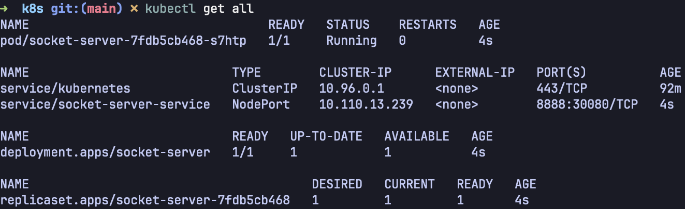

---

來源：[Assignment - Virtualization Lab](https://nthu-scopelab.github.io/cr-virtualization/docker_kubernetes/assignment.html)

## Assignment

### Requirements

#### 1\. Report (100 points)

-   You have to make a report of _**pdf format**_ named `HW2_<your_student_id>.pdf`, e.g. `HW2_113062566.pdf`.
-   The report should include the answers to the questions mentioned in the description of this lab.

### Submission

Submit the report to eeclass.

### Deadline

The deadline is set for November 17, 2025. Late submission is not allowed.

If you have any question, feel free to asking through eeclass or email.
