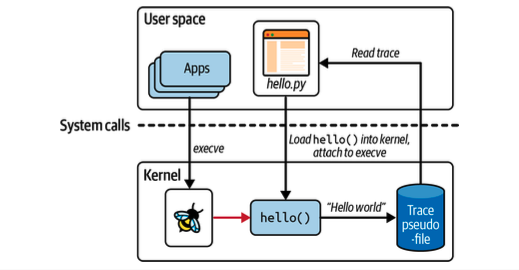
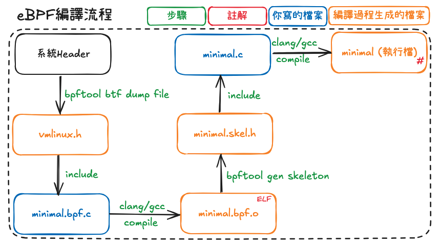
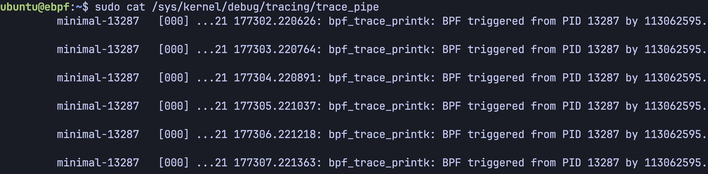
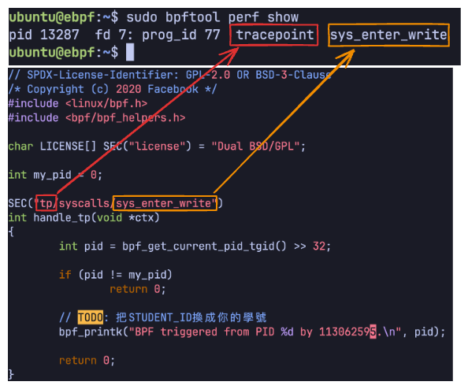

# HW3 - eBPF Minimal & Bootstrap

[eeclass 作業頁](https://eeclass.nthu.edu.tw/course/homework/57490) · [作業說明網站](https://easy-ebpf.github.io/lab/)

## 繳交內容

- [HW3_114064548.pdf](HW3_114064548.pdf)

[HW3\_114064548.pdf](HW3_114064548.pdf)

## 作業要求

本次作業包含lab1~lab2的部份，請依指示操作並截圖、回答問題:  
[https://easy-ebpf.github.io/lab/](https://easy-ebpf.github.io/lab/)

lab1跟lab2各佔本次作業的50分，合計100分。

本次作業有在烔朗(資電)館3F電腦教室的電腦桌面放置了VM映像practice\_vm.ova，同學可直接按[指示](https://github.com/easy-ebpf/practice_vm)匯入不用再重新下載。

完成之後，請將報告整合成一個pdf檔，命名為"HW3\_學號.pdf"並上傳至eeclass。

e.g. "HW3\_113062595.pdf"

遲交以零分計算，請把握時間完成。

課程錄影: [https://youtu.be/cALjh7I5dfg](https://youtu.be/cALjh7I5dfg)

---

來源：[eBPF介紹 - eBPF實作 - Lab](https://easy-ebpf.github.io/lab/01-intro/intro.html)

## eBPF 介紹

屬於核心（kernel）程式開發。與核心模組主要差別在**驗證器**（verifier）和 **map** 的設計。驗證器由 Linux kernel 提供，確認被加載的程式的正確性。map 則提供便利的通訊介面，讓 BPF 核心程式間和用戶程式能夠輕易的協作。

eBPF 程式的兩個目的：觀測追蹤（trace）的類別和改變核心行為的類別。

### 系統架構

系統元件圖:  

-   `hellp.py`、`hello()`：eBPF 程式，有核心和用戶兩個部分。課程中兩個部分都用 C 開發
-   `trace pseudofile`：eBPF 程式核心和用戶溝通的機制，透過特殊檔案或 map
-   `execve`、`小蜜蜂`：核心中的 tracepoint ，觸發附著的 eBPF 核心程式
-   `Apps`：系統上所有應用程式，可能在系統呼叫時進入 tracepoint

屬於核心（kernel）程式開發。與核心模組主要差別在**驗證器**（verifier）和 **map** 的設計。驗證器由 Linux kernel 提供，確認被加載的程式的正確性。map 則提供便利的通訊介面，讓 BPF 核心程式間和用戶程式能夠輕易的協作。

---

來源：[eBPF程式開發介紹: minimal - eBPF實作 - Lab](https://easy-ebpf.github.io/lab/01-intro/minimal.html)

## eBPF 程式開發介紹： minimal

### minimal 簡介

核心監測到用戶使用系統呼叫 `write()` 時輸出訊息，用戶附著完核心程式後會不斷使用 `write()`

### 程式架構

-   `minimal.bpf.c` ：核心程式
-   `minimal.skel.h` : 由`minimal.bpf.o`產生而來的skeleton，以便userspace中的`minimal.c`調用。
-   `minimal.c` ：用戶程式，負責加載和附著核心程式

### minimal.bpf.c

`// SPDX-License-Identifier: GPL-2.0 OR BSD-3-Clause /* Copyright (c) 2020 Facebook */  // 這裡不符常規，用 "linux/bpf.h" 取代 "vmlinux.h" // 需要定義在 bpf header 前面，因為 header 需要 kernel 類別 #include <linux/bpf.h> #include <bpf/bpf_helpers.h>  // SEC("license") 指定 symbol's section  char LICENSE[] SEC("license") = "Dual BSD/GPL";  // supported since Linux 5.5 int my_pid = 0;  // define program type and attachment point SEC("tp/syscalls/sys_enter_write") int handle_tp(void *ctx) {     // return u64. [63: 32] is tgid, [31: 0] is pid     // tgid is pid and pid is tid in kernel terminology     int pid = bpf_get_current_pid_tgid() >> 32;      if (pid != my_pid)         return 0;      // number of arguments is limited     bpf_printk("BPF triggered from PID %d.\n", pid);      return 0; }`

-   `char LICENSE[] SEC("license")`：聲明程式的 license 。有些 bpf api 需要 license 才能使用，載入程式的時候 verifier 會驗證
-   `my_pid`：核心和用戶也可以利用共用變數溝通

### minimal.skel.h

kernel 程式的抽象用結構體代表

`...  // 在呼叫 api 會使用 maps/progs/links // bss/data/rodata 用戶可以直接存取 struct minimal_bpf {     struct bpf_object_skeleton *skeleton;     struct bpf_object *obj;     struct {         struct bpf_map *bss;     } maps;     struct {         struct bpf_program *handle_tp;     } progs;     struct {         struct bpf_link *handle_tp;     } links;     struct minimal_bpf__bss {         int my_pid;     } *bss; };`

skeleton 提供用戶的 api ，簡單的 eBPF 用戶程式可以不用自己呼叫 libbpf ，只需要使用 skeleton api

`// setup static inline struct minimal_bpf *minimal_bpf__open(void) { ... } static inline int minimal_bpf__load(struct minimal_bpf *obj) { ... } static inline struct minimal_bpf *minimal_bpf__open_and_load(void) { ... } static inline int minimal_bpf__attach(struct minimal_bpf *obj) { ... }  // teardown static inline void minimal_bpf__destroy(struct minimal_bpf *obj) { ... } static inline void minimal_bpf__detach(struct minimal_bpf *obj) { ... }`

### minimal.c

用戶程式透過 `my_pid` 設定核心的過濾條件，只有 `minimal.c` 觸發的 `write()` 才會印 log

`int main(int argc, char **argv) {     struct minimal_bpf *skel = minimal_bpf__open();     skel->bss->my_pid = getpid();   // set global variable     err = minimal_bpf__load(skel);  // Load & verify BPF programs     err = minimal_bpf__attach(skel);      for (;;) {         fprintf(stderr, ".");         sleep(1);     }      minimal_bpf__destroy(skel);     ... }`

-   共用變數 `my_pid` 必須在程式加載前設定
-   tracepoints, kprobes 和特定類型的 eBPF 程式 libbpf 可以查看 `SEC()` 進行自動附著

---

來源：[eBPF編譯流程 - eBPF實作 - Lab](https://easy-ebpf.github.io/lab/01-intro/minimal-compile.html)

## eBPF 編譯流程

-   `minimal.bpf.c` ：核心程式
    -   Userspace程式調用之前會先用`bpftool`生成 `minimal.skel.h` skeleton 檔間接調用/載入該eBPF程式。
-   `minimal.c` ：用戶程式，加載和附著核心程式
-   `vmlinux.h` ：具有 kernel 內所有類別的定義
    -   由`bpftool btf dump file /sys/kernel/btf/vmlinux format c > vmlinux.h`生成。

### makefile

makefile 是自動化建置工具，透過撰寫檔名為 makefile 或 Makefile 的文字檔，定義檔案的相依和生成規則，將程式碼編譯成執行檔。使用時，在 makefile 檔案所在的目錄執行 `make <目標文件>` 生成特定目標， `make` 則是生成第一個規則的目標。

#### makefile 規則撰寫格式

`# 檔名為 makefile 或 Makefile  目標文件 ...：依賴項目 ...  # 多個項目透過空格分開     終端命令  # 開頭一定要是 TAB     ...練習`

特殊符號說明：

-   `$^`： 所有依賴項目
-   `$<`： 第一個依賴項目
-   `$@`： 目標文件

#### minimal makefile 示範

`# generate vmlinux header vmlinux.h:     bpftool btf dump file /sys/kernel/btf/vmlinux format c > vmlinux.h   # build bpf kernel object file minimal.bpf.o: minimal.bpf.c vmlinux.h     clang -g -O2 -target bpf -c $< -o $@  # generate skeleton minimal.skel.h: minimal.bpf.o     bpftool gen skeleton $< > $@  # build app minimal: minimal.c minimal.skel.h     clang -g minimal.c -lbpf -lelf -lz -o $@`

-   `-O2`, `-target bpf` 是必要的選項
-   `-lbpf -lelf -lz` 執行檔動態連結函式庫
-   執行檔不用連結核心目標檔

---

來源：[Lab 1： 操作和觀察 minimal 和 verifier - eBPF實作 - Lab](https://easy-ebpf.github.io/lab/01-intro/minimal-practice.html)

## Lab 1： 操作和觀察 minimal 和 verifier

-   如果你的電腦還沒有設定好eBPF的編譯工具，請參考[這裡](https://github.com/easy-ebpf/practice_vm)設定好你的環境，並下載最新版本的範例程式碼:
    
    `git clone https://github.com/easy-ebpf/lab`
    
-   如果你在資電館三樓的電腦教室，桌面應該已經有vm映像檔可以直接匯入，不用再下載一次，但請一樣clone最新的程式碼。
    
-   練習1: 建置 minimal 和觀察程式運行。
    
    -   修改`src/minimal/minimal.bpf.c`中的TODO，將`STUDENT_ID`換成你自己的學號。
        
    -   `make minimal` 建置執行檔，然後用 `sudo ./minimal` 執行
        
    -   打開新的terminal視窗/分頁，查看 eBPF 輸出訊息
        
        `sudo cat /sys/kernel/debug/tracing/trace_pipe`
        
        
    -   查看當前附著的程式
        
        `sudo bpftool perf show`
        
        

**Note:** 請截圖上方指令的執行畫面，並截圖附在報告中。 **(15 points)**

-   練習2:註解核心程式的 license 聲明，觀察 verifier 驗證不通過時的 log 提示並截圖。

**Note:** 請截圖上方的執行失敗畫面，並截圖附在報告中。 **(15 points)**

-   **回答問題**:
    -   1.  eBPF相較於kernel module的差異在哪裡? **(10 points)**
    -   2.  參考[這裡](https://docs.kernel.org/bpf/bpf_licensing.html#using-bpf-programs-in-the-linux-kernel)，並回答為什麼註解掉license聲明就會導致不通過verifier的驗證? **(5 points)**
    -   3.  參考[這裡](https://docs.kernel.org/bpf/verifier.html)，並回答linux kernel使用verifier檢查了eBPF程式的哪些面向來確保eBPF程式的安全性? **(5 points)**

---

來源：[eBPF 程式開發介紹： boostrap - eBPF實作 - Lab](https://easy-ebpf.github.io/lab/02-map/bootstrap_intro.html)

## eBPF 程式開發介紹： boostrap

### boostrap 簡介

附著到程式執行和結束的 tracepoint ，測量執行時間。

---

來源：[bootstrap map介紹 - eBPF實作 - Lab](https://easy-ebpf.github.io/lab/02-map/bootstrap_map_intro.html)

## boostrap map 介紹

附著到核心執行和結束程式的 tracepoint ，測量執行時間。

### hash map

#### bootstrap.bpf.c

宣告 eBPF map 的程式碼如下。根據種類，結構需要的成員各有不同， hash map 包含 `type`、`key`、`value`

`struct {     __uint(type, BPF_MAP_TYPE_HASH);     __uint(max_entries, 8192);     __type(key, pid_t);     __type(value, u64); } exec_start SEC(".maps");`

程式執行的時候，在 hash map 紀錄 pid 和時間

`SEC("tp/sched/sched_process_exec") int handle_exec(struct trace_event_raw_sched_process_exec *ctx) {     ...     bpf_map_update_elem(&exec_start, &pid, &ts, BPF_ANY); }`

程式結束的時候，利用 pid 查詢執行開始的時間，計算時長。將資訊透過 ring buffer 傳遞給用戶

`SEC("tp/sched/sched_process_exit") int handle_exit(struct trace_event_raw_sched_process_template *ctx) {     ...     /* if we recorded start of the process, calculate lifetime duration */     start_ts = bpf_map_lookup_elem(&exec_start, &pid);     if (start_ts)         duration_ns = bpf_ktime_get_ns() - *start_ts;     else if (min_duration_ns)         return 0;     bpf_map_delete_elem(&exec_start, &pid); }`

核心態 map api 相關說明

`/*  * bpf_map_lookup_elem  *  * 	Perform a lookup in *map* for an entry associated to *key*.  *  * Returns  * 	Map value associated to *key*, or **NULL** if no entry was  * 	found.  */ static void *(* const bpf_map_lookup_elem)(void *map, const void *key) = (void *) 1;  /*  * bpf_map_update_elem  *  * 	Add or update the value of the entry associated to *key* in  * 	*map* with *value*. *flags* is one of:  *  * 	**BPF_NOEXIST**  * 		The entry for *key* must not exist in the map.  * 	**BPF_EXIST**  * 		The entry for *key* must already exist in the map.  * 	**BPF_ANY**  * 		No condition on the existence of the entry for *key*.  *  * 	Flag value **BPF_NOEXIST** cannot be used for maps of types  * 	**BPF_MAP_TYPE_ARRAY** or **BPF_MAP_TYPE_PERCPU_ARRAY**  (all  * 	elements always exist), the helper would return an error.  *  * Returns  * 	0 on success, or a negative error in case of failure.  */ static long (* const bpf_map_update_elem)(void *map, const void *key, const void *value, __u64 flags) = (void *) 2;  /*  * bpf_map_delete_elem  *  * 	Delete entry with *key* from *map*.  *  * Returns  * 	0 on success, or a negative error in case of failure.  */ static long (* const bpf_map_delete_elem)(void *map, const void *key) = (void *) 3;`

核心及用戶 api 格式可能很像，但兩者是不同概念，一個使用系統呼叫，一個使用核心內的函式。

### ring buffer

#### bootstrap.bpf.c

eBPF ring buffer map 的宣告

`struct {     __uint(type, BPF_MAP_TYPE_RINGBUF);     __uint(max_entries, 256 * 1024); } rb SEC(".maps");`

從核心傳遞資料到用戶程式，api 操作流程大致為：

`// 分配記憶體 struct event *e = bpf_ringbuf_reserve(&rb, sizeof(*e), 0);  // 設定 e 的數值...  // 發送資料 bpf_ringbuf_submit(e, 0);`

#### bootstrap.c

用戶接收部分則是：

`// * 獲取資源，用 skeleton maps 下的成員指定 map // 在程式加載之後才能操作 map // * callback "handle_event" 來處理資料 rb = ring_buffer__new(bpf_map__fd(skel->maps.rb), handle_event, NULL, NULL); ...  // 處理資料的迴圈 while (!exiting) {     err = ring_buffer__poll(rb, 100 /* timeout, ms */); } ...  // 釋放資源 ring_buffer__free(rb);`

---

來源：[bootstrap核心程式的其他介紹 - eBPF實作 - Lab](https://easy-ebpf.github.io/lab/02-map/bootstrap-others.html)

## bootstrap核心程式的其他介紹

-   讀取系統核心的資料或記憶體，需要特別的函式。例如從系統取得目前行程的 `struct task_struct` 讀取 ppid (parent pid)
    
    `struct task_struct *task = (struct task_struct *)bpf_get_current_task(); pid_t ppid = BPF_CORE_READ(task, real_parent, tgid);`
    
    功能在普通 c 語言等同於
    
    `pid_t ppid = task->real_parent->tgid;`
    
    已經宣告變數時，要傳入指標和大小，同系列的 api 有：
    
    `BPF_CORE_READ_INTO(&ppid, task, real_parent, tgid); bpf_core_read(&ppid, sizeof(ppid), real_parent);`
    
-   從參數中讀取資料
    
    `SEC("tp/sched/sched_process_exec") int handle_exec(struct trace_event_raw_sched_process_exec *ctx) {     ...     fname_off = ctx->__data_loc_filename & 0xFFFF     bpf_probe_read_str(&e->filename, sizeof(e->filename), (void *)ctx + fname_off); }`
    
-   唯讀的全域變數定義須包含 const volatile ，跟 MMIO 操作的道理相同
    
    `const volatile unsigned long long min_duration_ns = 0;`

---

來源：[Lab 2：操作和觀察 bootstrap - eBPF實作 - Lab](https://easy-ebpf.github.io/lab/02-map/bootstrap-practice.html)

## Lab 2：操作和觀察 bootstrap

-   練習1：
    -   參考minimal的範例，撰寫 makefile 並編譯生成 bootstrap 執行檔
    -   運行 `sudo ./bootstrap` 並確認輸出訊息，如果輸出沒有偵測到process，則需要在系統中執行其它程式來觸發訊息的輸出。

**Note:** 請截圖上方bootstrap程式的執行畫面，並截圖附在報告中。 **(30 points)**

-   回答問題:
    
    -   1.  eBPF中的ring buffer跟hash map的差異在哪裡? **(10 points)**
    -   2.  追蹤bootstrap的程式碼，並回答它是如何在程式中使用ring buffer跟hash map的? **(10 points)**
-   其他：可以先熟悉一下 hash map 和 ring buffer 程式 api ， Lab 3 要開發 map 的程式
