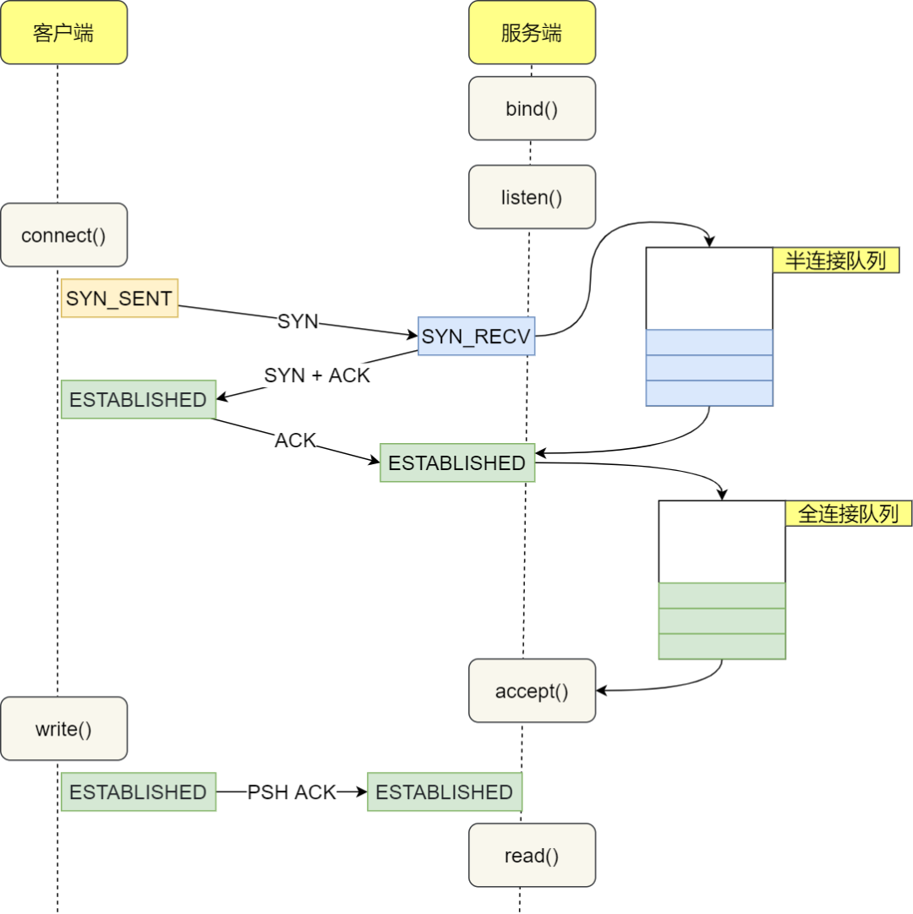

# HW4 - eBPF Hooks & Applications of Maps

[eeclass 作業頁](https://eeclass.nthu.edu.tw/course/homework/57846) · [作業說明網站](https://easy-ebpf.github.io/lab/03-tcprtt/target.html)

## 繳交內容

- [HW4_114064548.pdf](HW4_114064548.pdf)

## 作業要求

本次作業包含lab3-1~lab3-2的部份。

lab3-1跟lab3-2合計100分，請依指示操作並截圖、回答問題:  
[https://easy-ebpf.github.io/lab/03-tcprtt/target.html](https://easy-ebpf.github.io/lab/03-tcprtt/target.html)

完成之後，請將截圖跟回答放入報告整合成一個pdf檔，命名為"HW4\_學號.pdf"並上傳至eeclass。

e.g. "HW4\_113062595.pdf"

課程錄影: [https://youtu.be/NIlQLZa5lHo](https://youtu.be/NIlQLZa5lHo)

遲交以零分計算，請把握時間完成。

---

來源：[eBPF 追蹤程式開發：tcprtt 和 tcprtt_tp - eBPF實作 - Lab](https://easy-ebpf.github.io/lab/03-tcprtt/target.html)

## eBPF 追蹤程式開發：tcprtt 和 tcprtt\_tp

追蹤程式底下可以再分成 kprobe/kretprobe, fentry/fexit 和 tracepoint ：

-   kprobe/kretprobe, fentry/fexit: 主要觀察核心中的函式的進入和退出，可以取得呼叫函式的引數（arguments）和回傳值。被追蹤的程式無須修改和重新編譯，屬於動態追蹤的技術。
-   tracepoint: 核心程式碼設立和提供 tracepoint 以供觀測，屬於靜態追蹤。這套機制由 Linux 提供，屬於穩定的公開介面。

程式功能：輸出 TCP/IPV4 的延遲時間（round trip time），範例輸出如下：

`$ sudo ./tcprtt_tp  PID     COMM             SRC                         DST                     LAT(ms) 0       swapper/0        192.168.68.64   :53393  --> 20.42.65.94     :47873  196934.87 0       swapper/0        192.168.68.64   :52931  --> 172.217.163.36  :20480  6854.23`

追蹤程式共通流程：

-   核心程式：搜集網路通訊資料，使用 ring buffer 傳遞到用戶
-   用戶程式：加載和附著核心程式，迴圈不斷接收 ring buffer 資料輸出到終端

---

來源：[fentry 程式開發介紹：tcprtt - eBPF實作 - Lab](https://easy-ebpf.github.io/lab/03-tcprtt/fentry.html)

## fentry 程式開發介紹：tcprtt

`void tcp_rcv_established(struct sock *sk, struct sk_buff *skb);`

上面是附著的核心函式。當連線建立以後，每次用戶傳輸都會呼叫此函式。 fentry 的函式簽名會與附著的函式相同，並且可以讀取引數，例如 `sk`、`skb`，就可以藉此得到所需資訊。

### tcprtt.bpf.c 範例

`#include "vmlinux.h" #include <bpf/bpf_helpers.h> ...      // TODO: define ring buffer  SEC("fentry/tcp_rcv_established") int BPF_PROG(tcp_rcv, struct sock *sk /*, optional */) {     // handler ipv4 only     if (sk->__sk_common.skc_family != AF_INET)         return 0;          // TODO:     // 蒐集 ip, port...     // ring buffer 發送蒐集的資料     return 0; }`

使用 `BPF_PROG()` 定義 fentry 函式， `tcp_rcv` 是實際函式的名稱，後面則是參數，要依序對應附著的核心函式的參數。

### 蒐集輸出資料

-   pid, command：使用 `bpf_get_current_pid_tgid()`、`bpf_get_current_comm()`，用法參考 minimal 和 bootstrap
-   ip, port 和 rtt：需要從 `struct sock *sk` 取得

#### ip 和 port

被封裝在 `__sk_common` 中

`struct sock {     struct sock_common    __sk_common;     ... };`

類別其實都是整數，然後 `skc_rcv_saddr` 是來源 ip ，`skc_num` 是來源 port 。 只有 `skc_num` 是以 host endian ，其他皆為 network endian

`/**  *	struct sock_common - minimal network layer representation of sockets  *	@skc_daddr: Foreign IPv4 addr  *	@skc_rcv_saddr: Bound local IPv4 addr  *	@skc_dport: placeholder for inet_dport/tw_dport  *	@skc_num: placeholder for inet_num/tw_num  *	@skc_family: network address family  *  ...  */   struct sock_common {     __be32	skc_daddr;     __be32	skc_rcv_saddr;     ... }`

核心程式用 host endian 紀錄 port ，network endian 紀錄 ip，可以利用 `bpf_ntohs()`

#### rtt

使用 bpf\_tracing\_net.h 中的 `tcp_sk()`，傳入 `sk` 呼叫得到 `struct tcp_sock *` 。

``struct tcp_sock {     u32	srtt_us;	/* smoothed round trip time << 3 in usecs */`     ... };``

將 `srtt_us` 右移三位元就是 rtt 。因為 `struct tcp_sock` 是核心記憶體，得用 `BPF_CORE_READ` 讀取。

---

來源：[Lab 3-1: 開發tcprtt - eBPF實作 - Lab](https://easy-ebpf.github.io/lab/03-tcprtt/fentry-practice.html)

## Lab 3-1: 開發tcprtt

-   練習1：使用 ring buffer 開發，完成 **tcprtt.c** 和 **tcprtt.bpf.c** 程式
    
-   練習2：編譯並執行tcprtt。觀察輸出的 ip、port 數值是否正確。 在本機可以透過命令列工具簡單製造 tcp 連線
    
    `# server $ python3 -m http.server # client $ curl 0.0.0.0:8000`
    

**Note:** 請截圖上方的執行畫面並放入報告中。 **(30 points)**

---

來源：[tracepoint 程式開發介紹：tcprtt_tp - eBPF實作 - Lab](https://easy-ebpf.github.io/lab/03-tcprtt/tracepoint.html)

## tracepoint 程式開發介紹：tcprtt\_tp

三次交握時， socket 的狀態會改變。兩次“狀態改變”相隔的時間相當於 rtt ，也就是“從 **SYN\_SENT** 到 **ESTABLISHED** 的時間”和“從 **SYN\_RECV** 到 **ESTABLISHED** 的時間”，可以自行計算。

**inet\_sock\_set\_state** 這個 tracepoint 在每次 socket 狀態切換時被觸發，再透過 map 紀錄同個 socket 上次觸發的時間，就可以在狀態變成 **ESTABLISHED** 的時候計算 rtt 。另外，**TCP\_CLOSE** 代表連線關閉，可以刪除 map 中的紀錄。

### tcprtt\_tp.bpf.c 示範程式碼

`#include "vmlinux.h" #include <bpf/bpf_helpers.h> ...  // TODO: define ring buffer // TODO: define hash map  SEC("tracepoint/sock/inet_sock_set_state") int handle_set_state(struct trace_event_raw_inet_sock_set_state *ctx) {     // handle ipv4 only     if (ctx->family != AF_INET)         return 0;          // TODO:     // if oldstate, newstate are desired states:     //     蒐集 ip, port，計算 rtt     //     ring buffer 發送資料      // if newstate == TCP_CLOSE:     //     刪除 map 紀錄     // else     //     在 map 紀錄時間     return 0; }`

tracepoint 類型程式參數只有一個指標，類別則是 tracepoint 名稱加上前綴 `trace_event_raw_` ，定義在 `vmlinux.h`

### 搜集輸出資料

-   ip 和 port：從 `struct trace_event_raw_inet_sock_set_state *ctx` 取得
-   rtt：`bpf_ktime_get_ns()` 可以取得當前時間，map 紀錄上次觸發的時間，兩者相減得到 rtt

#### 參數類別說明

`struct trace_event_raw_inet_sock_set_state {     ...     const void *skaddr;     int oldstate;     int newstate;     __u16 sport;     __u16 dport;     __u8 saddr[4];     __u8 daddr[4]; };`

-   `skaddr`: 儲存 `struct sock` 的位址，可作為 hash map 的鍵
-   `old_state`, `newstate`: socket 狀態，例如： **TCP\_ESTABLISHED**, **TCP\_SYN\_SENT** ，定義在 vmlinux.h
-   `saddr`, `daddr`: ip，網路位元組順序，用 `bpf_core_read(dst, sz, src)` 讀取
-   `sport`, `dport`: port，本機位元組順序

---

來源：[Lab 3-2: 開發tcprtt_tp - eBPF實作 - Lab](https://easy-ebpf.github.io/lab/03-tcprtt/tracepoint-practice.html)

## Lab 3-2: 開發tcprtt\_tp

-   練習1：使用 hash map 開發，完成 **tcprtt\_tp.bpf.c** 程式
-   練習2：編譯並執行後，確認輸出的 ip、port 數值正確。

**Note:** 請截圖上方的執行畫面並放入報告中。 **(30 points)**

> 使用 Lab 3-1 的本機命令測試時，COMM 只會出現 curl ，但 ip、port 應正確顯示

-   回答問題:
    -   1.  請簡要說明fentry跟tracepoint的差異在哪裡。 **(20 points)**
    -   2.  fentry跟tracepoint的差異是否有帶來tcprtt程式表現上的差異? 為什麼? **(20 points)**
